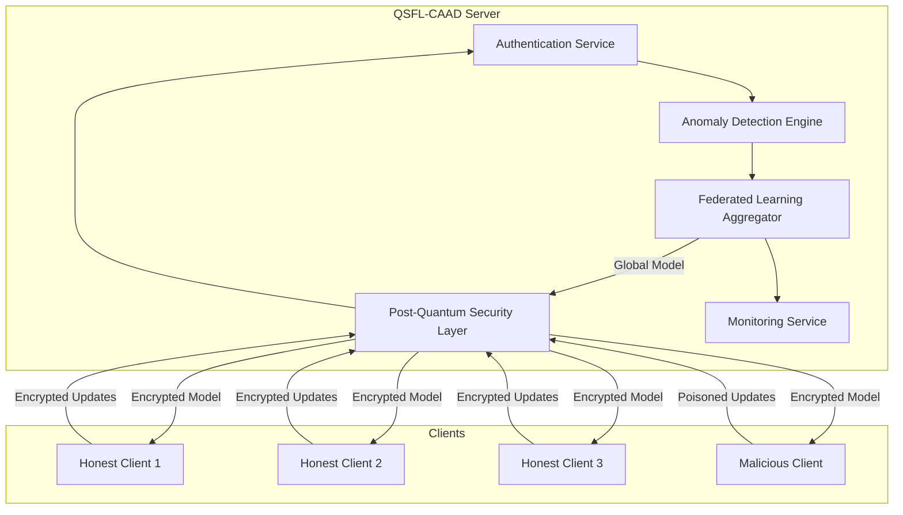

# QSFL-CAAD Design Document

## Overview

QSFL-CAAD is designed as a modular, secure federated learning system that integrates post-quantum cryptography, client authentication, and AI-driven anomaly detection. The system follows a client-server architecture where multiple clients collaboratively train a machine learning model while the server coordinates training rounds and enforces security policies.

The design prioritizes security, modularity, and extensibility while maintaining compatibility with existing federated learning frameworks like TensorFlow and PySyft.

## Architecture

### High-Level Architecture



### Component Architecture

The system is organized into five core modules:

1. **Post-Quantum Security Layer (pq_security/)**
2. **Client Authentication Module (auth/)**
3. **Anomaly Detection Engine (anomaly_detection/)**
4. **Federated Learning Core (federated_learning/)**
5. **Monitoring and Logging (monitoring/)**

## Components and Interfaces

### 1. Post-Quantum Security Layer

**Purpose:** Provides quantum-resistant cryptographic operations for all client-server communications.

**Key Classes:**
- `KyberKeyExchange`: Handles CRYSTALS-Kyber key establishment
- `DilithiumSigner`: Manages CRYSTALS-Dilithium digital signatures
- `PQCryptoManager`: Orchestrates all post-quantum cryptographic operations

**Interfaces:**
```python
class IPQCrypto:
    def generate_keypair(self) -> Tuple[bytes, bytes]
    def encrypt(self, plaintext: bytes, public_key: bytes) -> bytes
    def decrypt(self, ciphertext: bytes, private_key: bytes) -> bytes
    def sign(self, message: bytes, private_key: bytes) -> bytes
    def verify(self, message: bytes, signature: bytes, public_key: bytes) -> bool
```

**Implementation Strategy:**
- Primary: Use `pqcrypto` library if available
- Fallback: Custom implementations based on NIST specifications
- Security Level: Minimum 128-bit equivalent security

### 2. Client Authentication Module

**Purpose:** Manages client identity verification and credential lifecycle.

**Key Classes:**
- `ClientCredentialManager`: Issues and manages client credentials
- `AuthenticationService`: Verifies client identities
- `RevocationManager`: Handles credential revocation and blacklisting

**Interfaces:**
```python
class IAuthenticationService:
    def register_client(self, client_id: str) -> ClientCredentials
    def authenticate_client(self, client_id: str, signature: bytes, message: bytes) -> bool
    def revoke_client(self, client_id: str) -> None
    def is_client_valid(self, client_id: str) -> bool
```

**Authentication Flow:**
1. Client registration with server
2. Server generates Dilithium keypair for client
3. Client receives private key securely
4. All subsequent communications signed with client's private key
5. Server verifies signatures before processing updates

### 3. Anomaly Detection Engine

**Purpose:** Detects and responds to malicious client behavior using machine learning.

**Key Classes:**
- `IsolationForestDetector`: Implements anomaly detection using Isolation Forest
- `SHAPExplainer`: Provides interpretable explanations for anomaly scores
- `ClientReputationManager`: Tracks client behavior and manages reputation scores
- `ResponseOrchestrator`: Coordinates responses to detected anomalies

**Interfaces:**
```python
class IAnomalyDetector:
    def fit(self, normal_updates: List[ModelUpdate]) -> None
    def predict_anomaly_score(self, update: ModelUpdate) -> float
    def explain_anomaly(self, update: ModelUpdate) -> Dict[str, float]
    def update_model(self, new_updates: List[ModelUpdate]) -> None
```

**Detection Pipeline:**
1. Extract features from model updates (weight distributions, gradients, etc.)
2. Score updates using trained Isolation Forest
3. Generate SHAP explanations for anomalous updates
4. Apply dynamic response based on anomaly severity
5. Update client reputation scores

### 4. Federated Learning Core

**Purpose:** Orchestrates federated learning rounds with security integration.

**Key Classes:**
- `SecureFederatedServer`: Main server coordinating training rounds
- `ModelAggregator`: Aggregates client updates with security considerations
- `ClientManager`: Manages client connections and state
- `TrainingOrchestrator`: Coordinates training rounds and model distribution

**Interfaces:**
```python
class IFederatedLearningServer:
    def start_training_round(self) -> str
    def receive_client_update(self, client_id: str, update: ModelUpdate) -> bool
    def aggregate_updates(self, round_id: str) -> GlobalModel
    def distribute_global_model(self, model: GlobalModel) -> None
```

**Training Flow:**
1. Server initiates training round
2. Clients download current global model (encrypted)
3. Clients train locally and submit updates (signed)
4. Server authenticates and validates updates
5. Anomaly detection scores all updates
6. Secure aggregation of validated updates
7. Distribution of new global model

### 5. Monitoring and Logging

**Purpose:** Provides comprehensive system monitoring and audit capabilities.

**Key Classes:**
- `SecurityEventLogger`: Logs all security-related events
- `MetricsCollector`: Collects performance and accuracy metrics
- `AlertManager`: Generates alerts for suspicious activities
- `DashboardService`: Provides real-time system status

## Data Models

### Core Data Structures

```python
@dataclass
class ClientCredentials:
    client_id: str
    public_key: bytes
    private_key: bytes
    issued_at: datetime
    expires_at: datetime
    status: CredentialStatus

@dataclass
class ModelUpdate:
    client_id: str
    round_id: str
    weights: Dict[str, np.ndarray]
    signature: bytes
    timestamp: datetime
    metadata: Dict[str, Any]

@dataclass
class AnomalyReport:
    client_id: str
    anomaly_score: float
    shap_values: Dict[str, float]
    explanation: str
    recommended_action: ResponseAction
    timestamp: datetime

@dataclass
class TrainingRound:
    round_id: str
    participants: List[str]
    global_model_hash: str
    aggregation_method: str
    security_events: List[SecurityEvent]
    metrics: Dict[str, float]
```

### Database Schema

The system uses SQLite for simplicity with the following key tables:

- `clients`: Client registration and credential information
- `training_rounds`: Training round metadata and results
- `model_updates`: Client model updates and validation status
- `anomaly_reports`: Anomaly detection results and explanations
- `security_events`: Comprehensive security audit log

## Error Handling

### Error Categories and Responses

1. **Cryptographic Errors**
   - Invalid signatures → Reject update, log security event
   - Key exchange failures → Retry with exponential backoff
   - Encryption/decryption errors → Terminate session, alert administrator

2. **Authentication Errors**
   - Invalid credentials → Reject client, increment failure counter
   - Expired credentials → Prompt re-authentication
   - Revoked clients → Permanent rejection, security alert

3. **Anomaly Detection Errors**
   - Model training failures → Fall back to rule-based detection
   - SHAP explanation errors → Log warning, continue with basic scoring
   - Feature extraction errors → Skip update, log for investigation

4. **Network and Communication Errors**
   - Connection timeouts → Retry with circuit breaker pattern
   - Malformed messages → Reject and log potential attack
   - Protocol violations → Terminate connection, security alert

### Error Recovery Strategies

- **Graceful Degradation**: System continues operating with reduced functionality
- **Circuit Breaker**: Temporary isolation of failing components
- **Retry Logic**: Exponential backoff for transient failures
- **Fallback Mechanisms**: Alternative implementations for critical functions

## Testing Strategy

### Unit Testing

Each module includes comprehensive unit tests covering:
- Cryptographic operations with known test vectors
- Authentication flows with valid and invalid credentials
- Anomaly detection with synthetic malicious updates
- Federated learning aggregation with various client configurations

### Integration Testing

End-to-end tests validating:
- Complete federated learning rounds with security
- Attack scenarios with malicious clients
- System recovery from various failure modes
- Performance under different load conditions

### Security Testing

Specialized security tests including:
- Cryptographic protocol validation
- Attack simulation (model poisoning, gradient inversion)
- Authentication bypass attempts
- Anomaly detection evasion techniques

### Performance Testing

Benchmarking for:
- Cryptographic operation latency
- Anomaly detection throughput
- Federated learning convergence rates
- System scalability with increasing client counts

## Simulation Environment

### Dataset Configuration

- **Primary**: MNIST for rapid prototyping and testing
- **Secondary**: CIFAR-10 for more complex scenarios
- **Data Distribution**: IID and non-IID splits across clients
- **Poisoning Strategies**: Label flipping, gradient manipulation, backdoor attacks

### Client Simulation

- **Honest Clients (7-9)**: Follow protocol correctly, contribute clean updates
- **Malicious Clients (1-3)**: Inject various types of poisoned updates
- **Client Heterogeneity**: Different computational capabilities and data sizes
- **Network Simulation**: Variable latency and occasional disconnections

### Evaluation Metrics

- **Security Metrics**: Detection accuracy, false positive rate, time to detection
- **Performance Metrics**: Model accuracy, convergence speed, communication overhead
- **System Metrics**: Throughput, latency, resource utilization

## Deployment Considerations

### Development Environment
- Python 3.8+ with virtual environment
- Dependencies: TensorFlow, scikit-learn, cryptography, pqcrypto
- Development tools: pytest, black, mypy, pre-commit hooks

### Production Considerations
- Containerization with Docker for consistent deployment
- Kubernetes orchestration for scalability
- Secure key management with HSM integration
- Monitoring with Prometheus and Grafana
- Log aggregation with ELK stack

### Security Hardening
- Regular security audits and penetration testing
- Dependency vulnerability scanning
- Secure coding practices and code review
- Incident response procedures
- Regular cryptographic library updates