# QSFL-CAAD System Architecture

This document provides comprehensive architectural diagrams for the Quantum-Safe Federated Learning with Client Anomaly and Attack Detection (QSFL-CAAD) system.

## Table of Contents
1. [High-Level System Architecture](#high-level-system-architecture)
2. [Component Architecture](#component-architecture)
3. [Data Flow Architecture](#data-flow-architecture)
4. [Security Architecture](#security-architecture)
5. [Deployment Architecture](#deployment-architecture)

---

## High-Level System Architecture

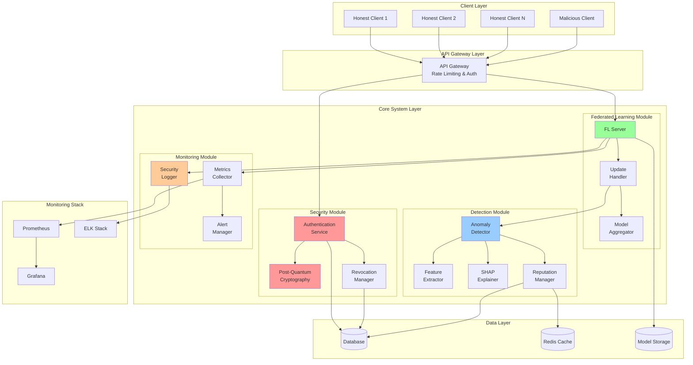

---

## Component Architecture

### Core Components Interaction

```mermaid
graph LR
    subgraph "Client Request Flow"
        CR[Client Request]
    end
    
    subgraph "Authentication Pipeline"
        A1[Validate Credentials]
        A2[Check Revocation]
        A3[Verify Signature]
        A4[Issue Token]
    end
    
    subgraph "Model Update Pipeline"
        M1[Receive Update]
        M2[Extract Features]
        M3[Detect Anomaly]
        M4[Update Reputation]
        M5[Aggregate Model]
    end
    
    subgraph "Response Flow"
        R1[Log Event]
        R2[Collect Metrics]
        R3[Send Response]
    end
    
    CR --> A1
    A1 --> A2
    A2 --> A3
    A3 --> A4
    A4 --> M1
    M1 --> M2
    M2 --> M3
    M3 --> M4
    M4 --> M5
    M5 --> R1
    R1 --> R2
    R2 --> R3
    
    style A1 fill:#ffcccc
    style M3 fill:#ccddff
    style M5 fill:#ccffcc
```

### Module Dependencies

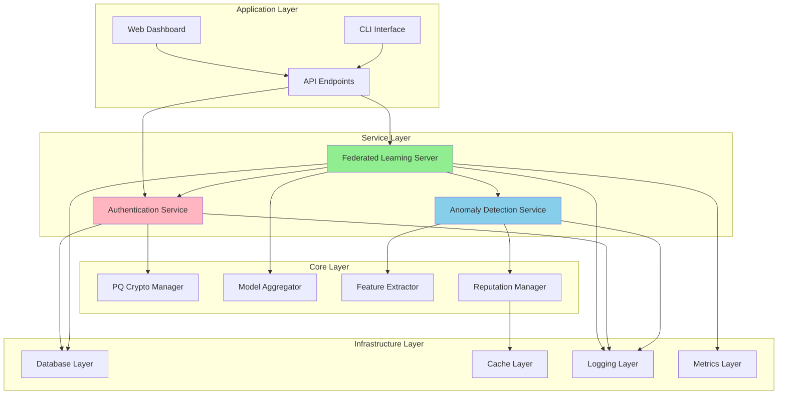

---

## Data Flow Architecture

### Training Round Data Flow

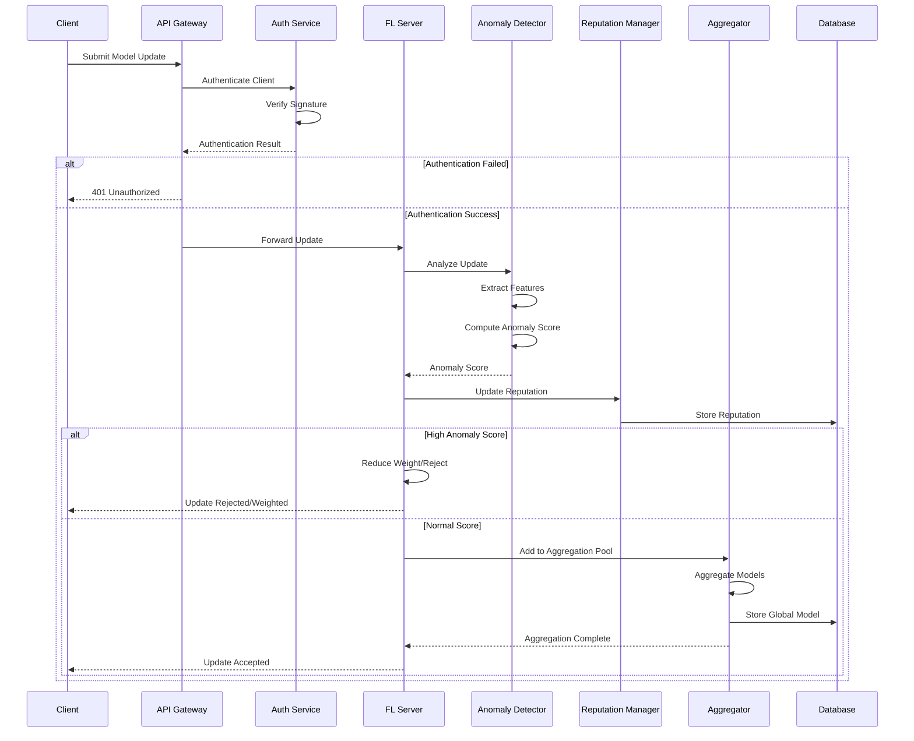

### Security Event Flow

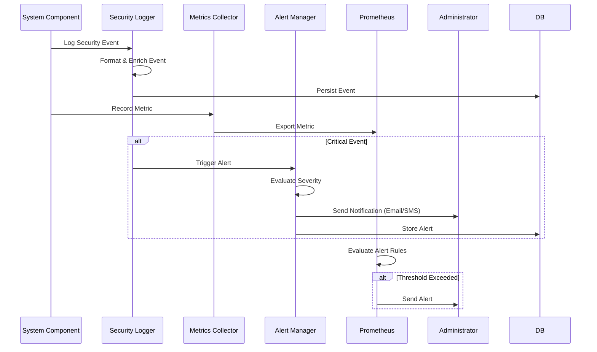

---

## Security Architecture

### Post-Quantum Cryptography Layer

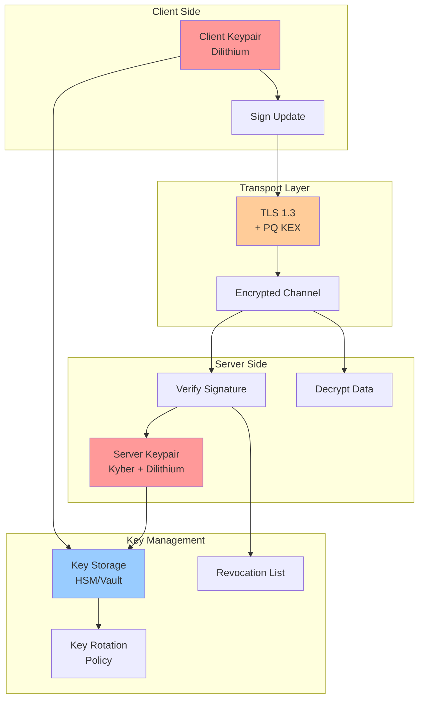

### Authentication & Authorization Flow

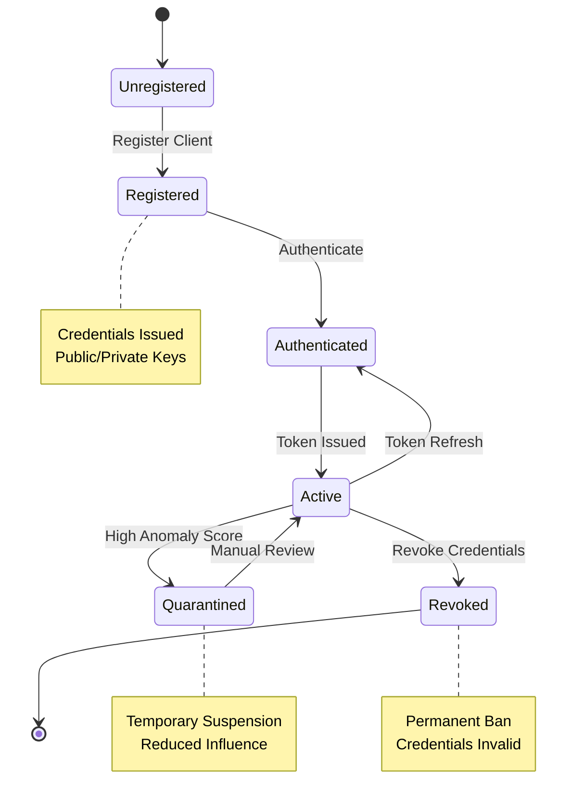

### Anomaly Detection Pipeline

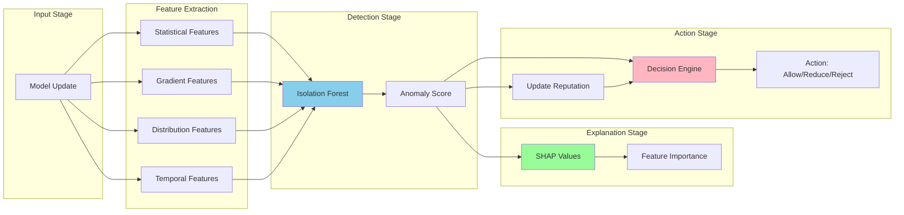

---

## Deployment Architecture

### Docker Compose Deployment

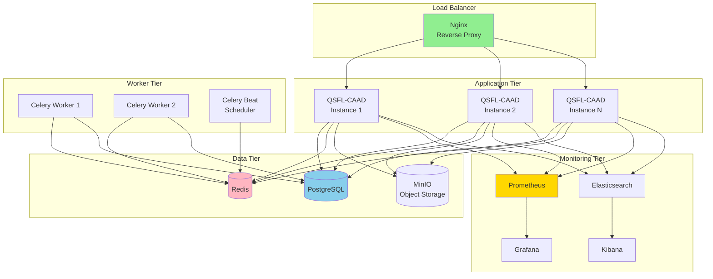

### Kubernetes Deployment

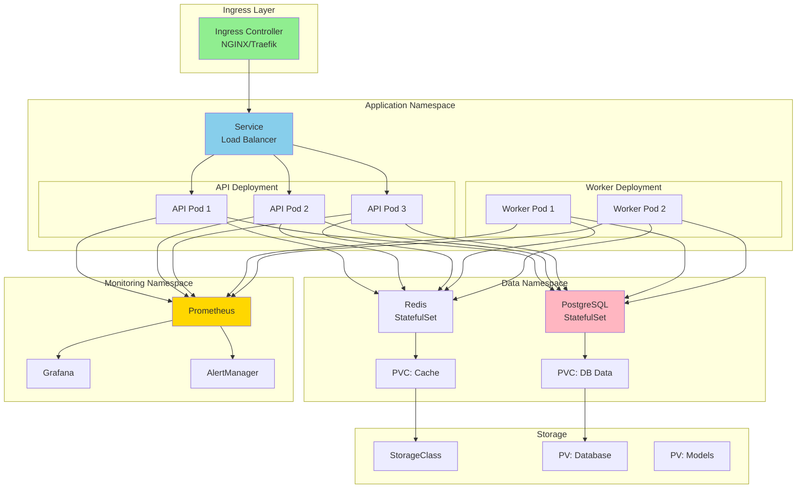

### Cloud Architecture (AWS Example)

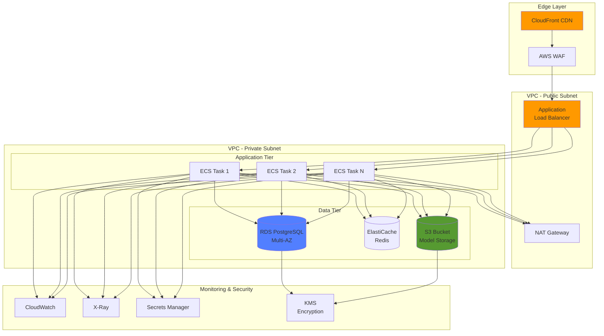

---

## Network Architecture

### Network Topology

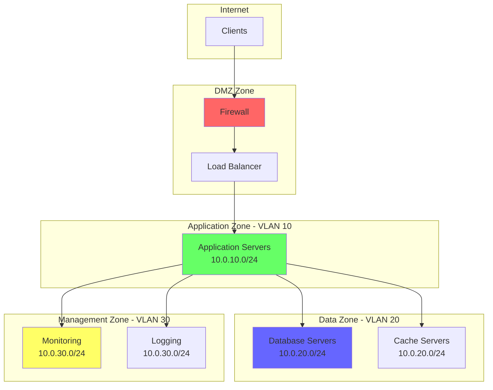

---

## Technology Stack

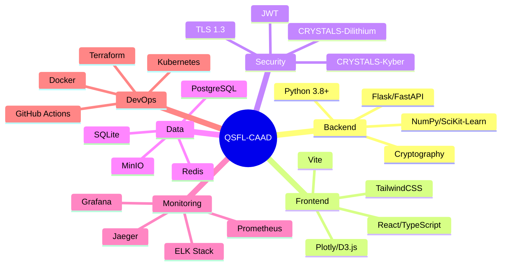

---

## Scalability Patterns

### Horizontal Scaling

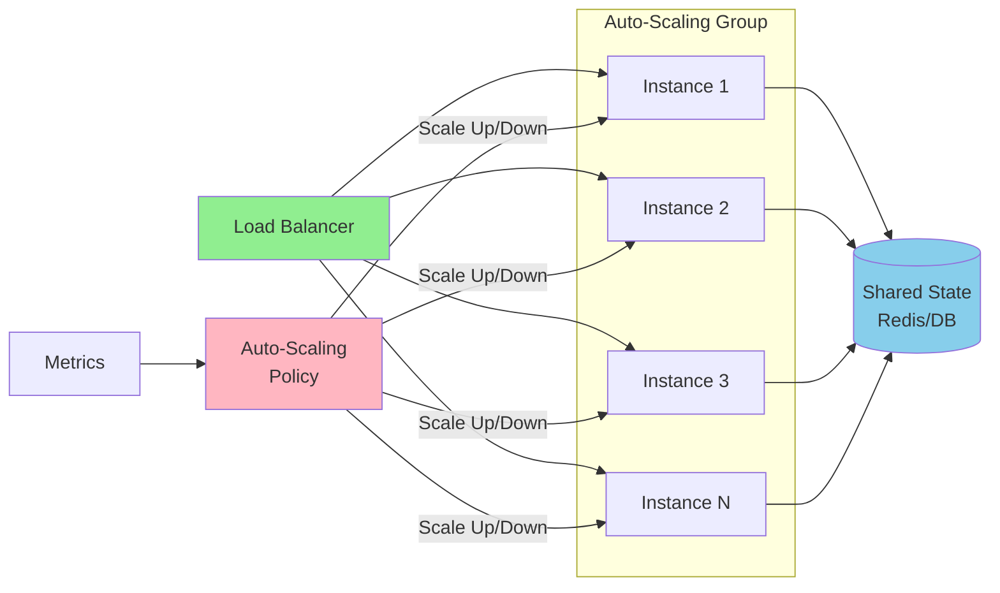

---

## Summary

This architecture provides:

1. **Modularity**: Clear separation of concerns across layers
2. **Scalability**: Horizontal scaling capabilities at each tier
3. **Security**: Defense in depth with multiple security layers
4. **Observability**: Comprehensive monitoring and logging
5. **Resilience**: High availability and fault tolerance
6. **Flexibility**: Support for multiple deployment scenarios

For implementation details, refer to:
- [API Documentation](API_DOCUMENTATION.md)
- [Deployment Guide](DEPLOYMENT_GUIDE.md)
- [Security Guide](SECURITY_GUIDE.md)
